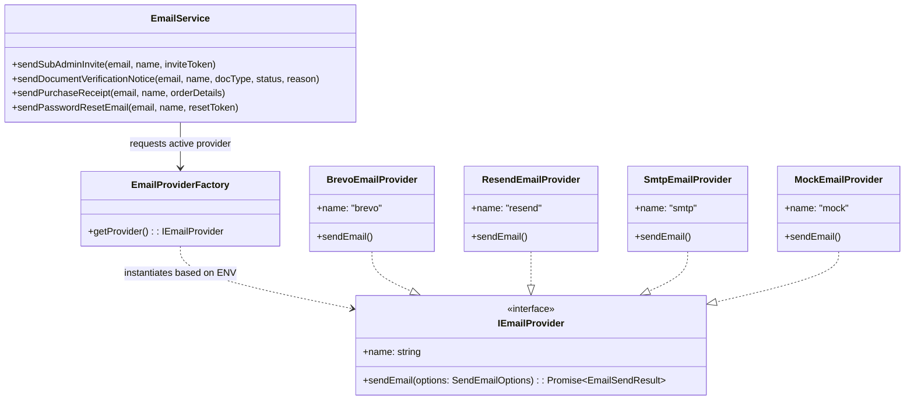

# Implementation Plan: Provider-Agnostic Email Service (Adapter Pattern)

This document outlines the design, architecture, and step-by-step implementation plan for a **Provider-Agnostic Email System** in the LMS platform backend. By leveraging the **Adapter (Strategy) Pattern**, the application business logic remains 100% decoupled from any specific email vendor (Brevo, Resend, SMTP, or Mock). Switching providers requires only a single environment variable change (`EMAIL_PROVIDER=brevo` | `EMAIL_PROVIDER=resend` | `EMAIL_PROVIDER=smtp` | `EMAIL_PROVIDER=mock`).

---

## 1. Architectural Design — Adapter Pattern



---

## 2. Proposed Component Breakdown

### Component 1: Email Abstractions & Contracts
- **`src/modules/email/providers/email-provider.interface.ts`**:
  Defines `SendEmailOptions`, `EmailSendResult`, and the `IEmailProvider` contract.

### Component 2: Provider Adapters
- **`src/modules/email/providers/mock.provider.ts`**:
  Logs formatted emails to standard logger (ideal for local development & unit tests without consuming API limits).
- **`src/modules/email/providers/brevo.provider.ts`**:
  Uses `@getbrevo/brevo` or direct Brevo REST API v3 payload.
- **`src/modules/email/providers/resend.provider.ts`**:
  Uses `resend` SDK or direct REST API payload.
- **`src/modules/email/providers/smtp.provider.ts`**:
  Uses `nodemailer` for generic SMTP configurations.

### Component 3: Provider Factory
- **`src/modules/email/providers/email-provider.factory.ts`**:
  Reads `envVars.EMAIL_PROVIDER` dynamically and returns the appropriate singleton instance.

### Component 4: High-Level Domain Email Service & HTML Templates
- **`src/modules/email/email.service.ts`**:
  Contains domain business methods (`sendSubAdminInvite`, `sendDocumentVerificationNotice`, etc.) and HTML template string renderers using modern, responsive styling.

### Component 5: Integration Hooks
- Wire up `emailService.sendSubAdminInvite` inside `admin.management.service.ts`.
- Wire up `emailService.sendDocumentVerificationNotice` in student KYC document processing.

---

## 3. Environment Configuration (`backend/.env`)

```env
# Provider Selection: brevo | resend | smtp | mock
EMAIL_PROVIDER=mock

# Common Sender Info
EMAIL_FROM_ADDRESS=noreply@yourdomain.com
EMAIL_FROM_NAME="Supermind Education Platform"

# Brevo Configuration (if EMAIL_PROVIDER=brevo)
BREVO_API_KEY=xkeysib-xxxxxxxxxxxxxxxxxxxxxxxxxxxxxxxx

# Resend Configuration (if EMAIL_PROVIDER=resend)
RESEND_API_KEY=re_xxxxxxxxxxxxxxxxxxxxxxxxxxxx

# SMTP Configuration (if EMAIL_PROVIDER=smtp)
SMTP_HOST=smtp.relay.example.com
SMTP_PORT=587
SMTP_USER=user@example.com
SMTP_PASS=secretpassword
```

---

## 4. Proposed File Changes

#### [NEW] `backend/src/modules/email/providers/email-provider.interface.ts`
#### [NEW] `backend/src/modules/email/providers/mock.provider.ts`
#### [NEW] `backend/src/modules/email/providers/brevo.provider.ts`
#### [NEW] `backend/src/modules/email/providers/resend.provider.ts`
#### [NEW] `backend/src/modules/email/providers/smtp.provider.ts`
#### [NEW] `backend/src/modules/email/providers/email-provider.factory.ts`
#### [NEW] `backend/src/modules/email/templates/email-templates.ts`
#### [NEW] `backend/src/modules/email/email.service.ts`
#### [MODIFY] `backend/src/config/envVars.ts` (Add optional Zod schemas for `EMAIL_PROVIDER`, `BREVO_API_KEY`, `RESEND_API_KEY`, etc.)
#### [MODIFY] `backend/src/modules/admin/management/admin.management.service.ts` (Integrate email sending for sub-admin invites)

---

## 5. Verification Plan

### Automated & Manual Tests
1. **Mock Provider Test**: Run in `mock` mode. Verify logs output formatted email contents with links.
2. **Brevo Provider Test**: Switch to `EMAIL_PROVIDER=brevo` with valid API key. Trigger email and verify reception in inbox.
3. **Resend Provider Test**: Switch to `EMAIL_PROVIDER=resend` with valid API key. Trigger email and verify reception in inbox.
4. **Sub-Admin Invitation E2E**: Verify invitation email arrives, token is validated, and sub-admin account is activated.
