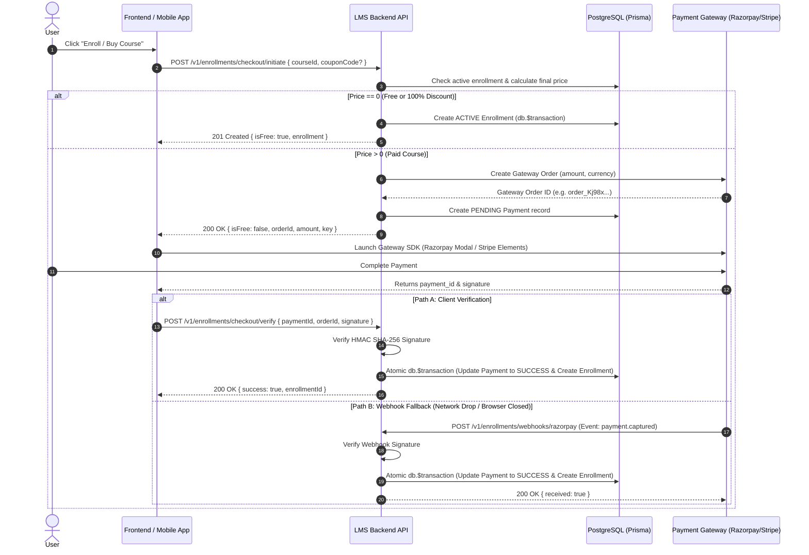

# 📑 Enrollment & Payment Module — Architectural Blueprint & Plan

---

## 🎯 1. Executive Overview & System Goals

The **Enrollment & Payment Module** is the core monetization and access-control engine of the LMS platform. It bridges course discovery with course consumption by governing enrollment creation, payment gateway integration, cryptographic verification, transaction auditing, access expiration, and manual admin overrides.

### Core System Goals:
1. **Dual Checkout Pathways**:
   - **Instant Direct Path**: 100% free courses or 100% coupon discounts bypass payment gateways and immediately create an `ACTIVE` enrollment inside an atomic transaction.
   - **Payment Gateway 2-Phase Path**: Paid courses initiate a Payment Gateway Order (`Razorpay` / `Stripe`), hold a `PENDING` payment record, and confirm access upon signature verification or webhook dispatch.
2. **Idempotency & Race Condition Protection**:
   - Database-level `@@unique([userId, courseId])` constraint prevents duplicate active enrollments.
   - Webhook & Client Verification endpoints use strict transaction locks (`db.$transaction`) to prevent double-processing.
3. **Cryptographic Payment Integrity**:
   - Razorpay HMAC SHA-256 signature validation before granting enrollment.
   - Idempotent transaction logging for audit and accounting reconciliation.
4. **Access Duration & Expiration Management**:
   - Snapshots `Course.accessDurationDays` at enrollment time to populate `expiresAt`.
   - Dynamic access check in service layer ensures expired enrollments block video/pdf access immediately.

---

## 🔄 2. Transaction & State Machine Lifecycle

### 2.1 State Machines

#### Enrollment Status:
```
  [Initiated] ────> ACTIVE ────> COMPLETED (100% lessons finished)
                      │
                      ├───> EXPIRED (expiresAt < now)
                      ├───> CANCELLED
                      └───> REFUNDED
```

#### Payment Status:
```
  [Init Order] ───> PENDING ───┬───> SUCCESS ───> REFUNDED
                              └───> FAILED
```

---

### 2.2 Payment Flow Diagram



---

## 🛣️ 3. API Endpoints Specification

### 3.1 User-Facing Endpoints

| Endpoint | Method | Middleware | Description |
| :--- | :--- | :--- | :--- |
| `POST /v1/enrollments/checkout/initiate` | `POST` | `authenticateUser` | Initiates checkout. If course is free or 100% discounted, creates enrollment instantly. If paid, creates PG Order & pending payment record. |
| `POST /v1/enrollments/checkout/verify` | `POST` | `authenticateUser` | Cryptographically verifies payment signature (`paymentId`, `orderId`, `signature`) and finalizes enrollment. |
| `POST /v1/enrollments/webhooks/razorpay` | `POST` | *Raw Body Signature* | Webhook handler for async payment confirmations (fallback when client drops connection). |
| `GET /v1/enrollments` | `GET` | `authenticateUser` | Lists logged-in user's enrollment history with status filters & payment receipts. |
| `GET /v1/enrollments/:enrollmentId` | `GET` | `authenticateUser` | Detailed invoice receipt for a specific enrollment. |

---

### 3.2 Admin & Management Endpoints

| Endpoint | Method | Middleware | Description |
| :--- | :--- | :--- | :--- |
| `POST /v1/admin/enrollments/manual` | `POST` | `verifyAdmin` | Manually grants course access to a student (free grant by admin). |
| `PATCH /v1/admin/enrollments/:enrollmentId/revoke` | `PATCH` | `verifyAdmin` | Revokes or refunds a student enrollment and updates status to `CANCELLED` or `REFUNDED`. |
| `GET /v1/admin/enrollments` | `GET` | `verifyAdmin` | Admin view of all platform enrollments with pagination, search, and status filters. |

---

## 🛠️ 4. Detailed Data Schemas (Zod)

The schemas for the module will be located in `src/modules/enrollments/enrollment.schema.ts`:

1. **`InitiateCheckoutSchema`**:
   - `courseId`: UUID string (required)
   - `couponCode`: Optional string

2. **`VerifyPaymentSchema`**:
   - `paymentId`: string (Razorpay payment ID or Stripe payment intent ID)
   - `orderId`: string (Razorpay order ID)
   - `signature`: string (HMAC signature for Razorpay)

3. **`ManualEnrollmentSchema`**:
   - `userId`: UUID string
   - `courseId`: UUID string
   - `reason`: Optional string

4. **`RevokeEnrollmentSchema`**:
   - `reason`: string
   - `refund`: boolean (default `false`)

5. **`EnrollmentQuerySchema`**:
   - `status`: Optional enum (`ACTIVE`, `COMPLETED`, `CANCELLED`, `REFUNDED`, `EXPIRED`)
   - `cursor`: Optional UUID
   - `limit`: Optional number (default 20)

---

## 🔒 5. Database Transactions & Tightly Coupled Multi-Table Operations

To prevent data corruption, inconsistent billing states, or orphaned records, the following **5 critical operations** are strictly wrapped inside Prisma Interactive Transactions (`db.$transaction(async (tx) => { ... })`):

### ⚡ Transaction Matrix

| # | Event Trigger | Tightly Coupled Operations | Failure Risk without `db.$transaction` |
| :--- | :--- | :--- | :--- |
| **1** | **Payment Verification & Webhook** | 1. Lock & check `Payment` status (`PENDING`) <br> 2. Update `Payment.status = SUCCESS` <br> 3. Upsert `Enrollment` (`status: ACTIVE`, `expiresAt`) <br> 4. Create `Transaction` log (`type: DEBIT`, `status: SUCCESS`) <br> 5. Increment `Course.enrolledCount` | **High Risk**: User charged on Razorpay, `Payment` updated to `SUCCESS`, but server crashes before `Enrollment` is created $\rightarrow$ User loses money without course access. |
| **2** | **Free Course Checkout** | 1. Verify `Course.isFree === true` or `Course.price === 0` <br> 2. Create `$0` `Payment` (`status: SUCCESS`) <br> 3. Create `Enrollment` (`status: ACTIVE`) <br> 4. Create `$0` `Transaction` audit log | **Medium Risk**: Inconsistent state if `Enrollment` is created without transaction log. |
| **3** | **Course Completion & Certificate** | 1. Upsert `LessonProgress` record <br> 2. Calculate % total completed lessons <br> 3. Update `Enrollment.completedAt = now` <br> 4. Generate & insert unique `Certificate` record | **Medium Risk**: Course marked as `COMPLETED` but `Certificate` record generation fails $\rightarrow$ Student cannot view or download certificate. |
| **4** | **Admin Refund & Revocation** | 1. Update `Enrollment.status = REFUNDED` <br> 2. Update `Payment.status = REFUNDED` <br> 3. Create `Transaction` audit log (`type: REFUND`) <br> 4. Mark `Certificate.isRevoked = true` (if issued) | **High Risk**: Payment marked `REFUNDED` but enrollment access remains `ACTIVE` $\rightarrow$ Student gets free money back AND keeps course access. |


---

## 🛡️ 6. Real-World Failure Recovery & Edge Case Handling

1. **Dual Verification Idempotency**:
   - What if both the frontend `verify` endpoint and the backend `webhook` execute at the exact same millisecond?
   - **Solution**: The transaction checks `Payment.status === "SUCCESS"`. If already processed by the other path, it safely returns the existing enrollment without throwing an error or creating duplicate records.
2. **Expired Access Handling**:
   - `expiresAt` is calculated as `enrolledAt + accessDurationDays * 86,400,000 ms`.
   - If `Course.accessDurationDays` is `null`, `expiresAt` is set to `null` (lifetime access).
   - In `courseService.getLearnData`, access is blocked if `expiresAt < new Date()`.
3. **Invalid/Failed Signature**:
   - If signature verification fails in `verify`, the payment record status is updated to `FAILED`, a `Transaction` log is recorded with `status: "FAILED"`, and a `400 Bad Request` error is thrown.
4. **Already Enrolled Check**:
   - If user is already actively enrolled in the course, `checkout/initiate` throws `400 Bad Request` ("You are already actively enrolled in this course").

---

## 📋 6. Sequential Build Order

We will build the Enrollment Module endpoint by endpoint following our standard modular pattern:

1. **Schemas & Boilerplate**: Create `enrollment.schema.ts`, `enrollment.service.ts`, `enrollment.controller.ts`, `enrollment.routes.ts`.
2. **Endpoint 1 (`POST /v1/enrollments/checkout/initiate`)**: Direct free enrollment + PG Order initialization logic.
3. **Endpoint 2 (`POST /v1/enrollments/checkout/verify`)**: Signature verification & atomic enrollment creation.
4. **Endpoint 3 (`POST /v1/enrollments/webhooks/razorpay`)**: Webhook handler with raw body verification.
5. **Endpoint 4 (`GET /v1/enrollments` & `GET /v1/enrollments/:enrollmentId`)**: User enrollment history & invoice details.
6. **Endpoint 5 (`POST /v1/admin/enrollments/manual`)**: Manual admin grant.
7. **Endpoint 6 (`PATCH /v1/admin/enrollments/:enrollmentId/revoke`)**: Revoke / refund enrollment.
8. **Endpoint 7 (`GET /v1/admin/enrollments`)**: Admin enrollment list with search & filters.
