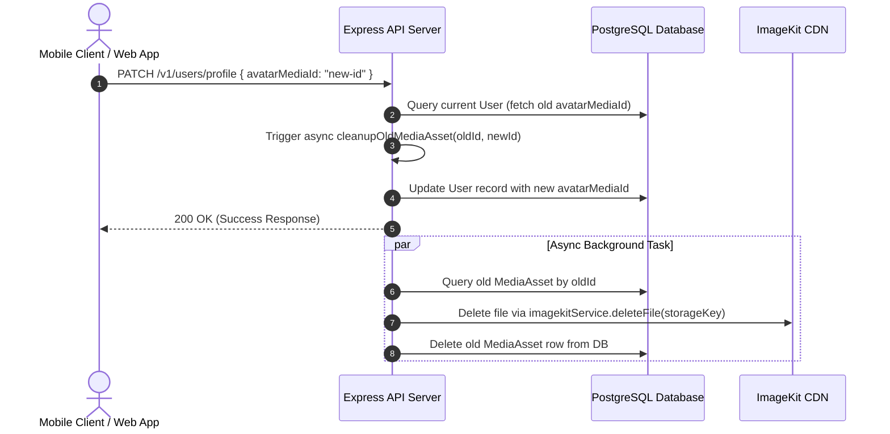

# Media Pipeline Architecture & Production Edge Cases Strategy

This document outlines the complete architectural design, implemented cleanup mechanisms, and recommended edge-case mitigation strategies for media storage, file management, and video streaming on the LMS Platform.

---

## 1. Implemented Duplication & Cleanup Architecture

To prevent storage leaks and minimize ImageKit CDN costs, we implemented a **Reference Replacement & Asynchronous Cleanup Pattern**.

### Covered Media Fields:
The backend automatically purges old CDN files and database records whenever any of the following fields are updated with a new asset:
* 👤 **User Avatar**: `User.avatarMediaId`
* 🆔 **Aadhaar Document**: `UserPersonalDetails.aadhaarFileId`
* 💳 **PAN Document**: `UserPersonalDetails.panFileId`
* ✍️ **Signature Image**: `UserPersonalDetails.signatureImageId`
* 🎓 **College Result**: `UserEducationDetails.collegeResultFileId`
* 📜 **Class XII Result**: `UserEducationDetails.classXIIResultFileId`
* 📜 **Class X Result**: `UserEducationDetails.classXResultFileId`

### Technical Flow (`cleanupOldMediaAsset`):


### Key Advantages:
1. **Zero Client Latency**: The cleanup runs asynchronously in a non-blocking background promise.
2. **Zero Downtime**: The old file remains intact until the database reference swap is initiated.
3. **Automated Cost Control**: Deletes replaced files immediately from ImageKit CDN storage.

---

## 2. Top 5 Production Edge Cases & Mitigation Strategies

### 🚨 1. Abandoned / Orphaned Upload Garbage Collection
* **The Problem**: A user uploads a 500MB video or 10MB PDF directly to ImageKit, but closes the app or cancels before clicking "Save". The file is uploaded to ImageKit and recorded in `MediaAsset`, but never linked to any entity.
* **Mitigation Strategy**: Implement a daily background **Cron Sweeper Job** (`node-cron` or BullMQ).
* **Sample Sweeper Query**:
  ```typescript
  // Run daily at 3:00 AM
  const cutoff = subHours(new Date(), 24);
  const orphanedAssets = await db.mediaAsset.findMany({
      where: {
          createdAt: { lt: cutoff },
          uploadStatus: "INITIATED",
          usersWithAvatar: { none: {} },
          aadhaarFileFor: { none: {} },
          panFileFor: { none: {} },
          signatureFor: { none: {} },
          collegeResultFor: { none: {} },
          classXIIResultFor: { none: {} },
          classXResultFor: { none: {} },
          lessonContents: { none: {} },
          coursesWithThumbnail: { none: {} },
      }
  });

  for (const asset of orphanedAssets) {
      if (asset.provider === "IMAGEKIT" && asset.storageKey) {
          await imagekitService.deleteFile(asset.storageKey).catch(() => {});
      }
      await db.mediaAsset.delete({ where: { id: asset.id } }).catch(() => {});
  }
  ```

---

### 🔒 2. File MIME-Type Spoofing (Executable Upload Risk)
* **The Problem**: A malicious user renames `malware.exe` to `assignment.pdf` and uploads it.
* **Mitigation Strategy**:
  1. **ImageKit Dashboard Security Rules**: Restrict allowed extensions in ImageKit Dashboard Settings under `Media Library Security` to strictly allow: `pdf, png, jpg, jpeg, webp, mp4, mov, m3u8`.
  2. **Magic Byte Verification**: Check binary headers (`0x25 0x50 0x44 0x46` for PDF) if uploading via backend buffer.

---

### 🎬 3. Video Hotlinking & Piracy Protection
* **The Problem**: Paid course video links (`.m3u8` HLS playlists) could be extracted from network traffic and shared publicly.
* **Mitigation Strategy**:
  1. **Short-Lived Signed URLs**: All video streaming URLs must use `imagekitService.getSignedUrl(url, 7200)` (2-hour expiring HMAC signature token).
  2. **Referrer Domain Restrictions**: Configure ImageKit HTTP Referrer Whitelisting to only serve assets to your official mobile app bundle ID (`com.lms.app`) and web domain (`https://lms.com`).

---

### 🔄 4. Rapid Duplicate Upload Race Conditions
* **The Problem**: Clicking "Upload Document" multiple times in quick succession fires duplicate HTTP requests.
* **Mitigation Strategy**:
  - **Client-Side**: Disable upload buttons immediately upon click and render a modal loader with progress % bar.
  - **Server-Side**: Use unique idempotency tokens or standard atomic Prisma reference replacements.

---

### 🗑️ 5. Accidental Deletion Recovery (Soft Delete Grace Period)
* **The Problem**: An instructor or admin accidentally deletes a lesson or course, immediately purging video files from ImageKit with no restore path.
* **Mitigation Strategy**:
  - Implement a `deletedAt: DateTime?` column on `MediaAsset`.
  - Perform **Soft Deletes** during normal app operation.
  - Hard-purge files from ImageKit only after a **30-day grace period**.

---

## 3. Checklist for Production Readiness

- [x] Integrate ImageKit `@imagekit/nodejs` V7 SDK
- [x] Client HMAC Authentication endpoint (`GET /v1/upload/imagekit/auth`)
- [x] Upload Completion verification endpoint (`POST /v1/upload/imagekit/complete`)
- [x] Replaced Asset Cleanup (`cleanupOldMediaAsset`) across Profile and User modules
- [ ] Configure ImageKit Dashboard Domain & Extension Security Restrictions
- [ ] Implement Cron Sweeper for Orphaned Upload Cleanup (>24h)
- [ ] Implement Soft Delete Grace Period for Admin Course Deletions
